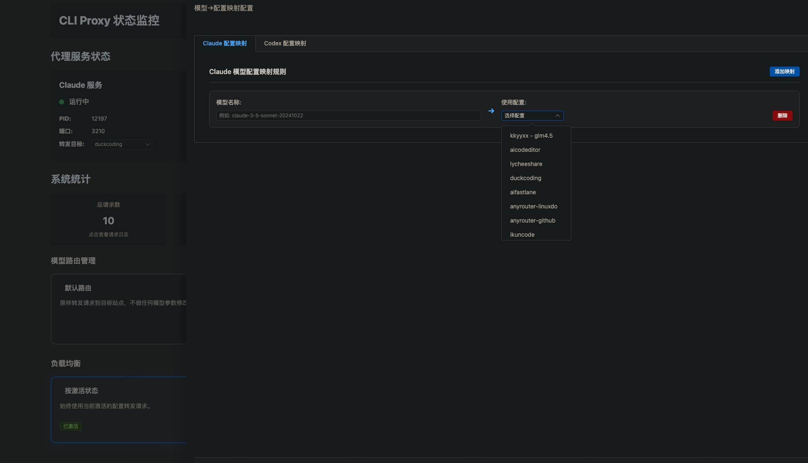

# CLP (CLI Proxy) - 本地AI代理工具

## 项目简介

CLP 是一个本地CLI代理工具，用于管理和代理AI服务（如Claude和Codex）的API请求。该工具提供统一的命令行界面来启动、停止和管理多个AI服务代理，支持多配置管理和Web UI监控。

## 亮点
- **动态切换配置**: 支持命令行/UI界面动态切换不同的服务配置，【无需重启claude/codex命令行终端，上下文保留】
- **敏感数据过滤**: 可将敏感数据配置到请求过滤器中，防止泄露
- **多服务支持**: 支持各种中转站配置，无需繁琐调整json配置后重启客户端
- **token使用统计**: 解析请求中的token使用情况
- **模型路由管理**: 支持自定义模型路由，灵活控制请求目标站点的模型名称
- **负载均衡**: 支持“号池管理” 按选择/权重的智能负载均衡，失败后切换下一权重站点

## 界面预览




## 主要功能

### 🚀 核心功能
- **多服务代理**: 支持Claude（端口3210）和Codex（端口3211）代理服务
- **配置管理**: 支持多配置切换和管理
- **Web UI界面**: 提供Web界面（端口3300）监控代理状态和使用统计
- **请求过滤**: 内置请求过滤机制
- **流式响应**: 支持流式API响应处理
- **使用统计**: 自动记录和分析API使用情况

### 📊 监控功能
- 实时服务状态监控
- API使用量统计
- 请求/响应日志记录
- 配置状态跟踪

## 技术栈

- **Python 3.7+**
- **FastAPI**: 异步Web框架，用于代理服务
- **Flask**: Web UI界面
- **httpx**: 异步HTTP客户端
- **uvicorn**: ASGI服务器
- **psutil**: 进程管理

## 项目结构

```
src/
├── main.py                     # 主入口文件
├── core/
│   └── base_proxy.py          # 基础代理服务类
├── claude/
│   ├── configs.py             # Claude配置管理
│   ├── ctl.py                 # Claude服务控制器
│   └── proxy.py               # Claude代理服务
├── codex/
│   ├── configs.py             # Codex配置管理
│   ├── ctl.py                 # Codex服务控制器
│   └── proxy.py               # Codex代理服务
├── config/
│   ├── config_manager.py      # 配置管理器
│   └── cached_config_manager.py # 缓存配置管理器
├── filter/
│   ├── request_filter.py      # 请求过滤器
│   └── cached_request_filter.py # 缓存请求过滤器
├── ui/
│   ├── ctl.py                 # UI服务控制器
│   ├── ui_server.py           # Flask Web UI服务
│   └── static/                # 静态资源文件
└── utils/
    ├── platform_helper.py     # 平台工具
    └── usage_parser.py        # 使用统计解析器
```
## 快速开始

### 安装
```bash
pip install --user --force-reinstall ./dist/clp-1.8.0-py3-none-any.whl
pip install --user --force-reinstall ./dist/clp-1.9.0-py3-none-any.whl
# 更新后需要重启服务新功能才生效（先杀掉clp占用的三个端口保险一点）
# macOS / Linux
lsof -ti:3210,3211,3300 | xargs kill -9
clp restart
```

## 命令使用方法

### 基本命令

```bash
# 启动所有服务
clp start

# 停止所有服务
clp stop

# 重启所有服务
clp restart

# 查看服务状态
clp status

# 启动Web UI界面
clp ui
```

### 配置管理（可在UI界面快速添加和切换配置）

```bash
# 列出Claude的所有配置
clp list claude

# 列出Codex的所有配置
clp list codex

# 激活Claude的prod配置
clp active claude prod

# 激活Codex的dev配置
clp active codex dev
```

### claude 使用方法
1. 修改 `~/.claude/settings.json` Claude配置文件，连接本地CLI代理服务
```json
{
  "env": {
    "ANTHROPIC_AUTH_TOKEN": "-",
    "ANTHROPIC_BASE_URL": "http://127.0.0.1:3210",
    "CLAUDE_CODE_DISABLE_NONESSENTIAL_TRAFFIC": "1",
    "CLAUDE_CODE_MAX_OUTPUT_TOKENS": "32000",
    "MAX_THINKING_TOKENS": "30000",
    "DISABLE_AUTOUPDATER": "1"
  },
  "permissions": {
    "allow": [],
    "deny": []
  }
}
```
2. 重启Claude命令行即可（确保本地代理已启动 clp start）

### codex 使用方法
1. 修改 `~/.codex/config.toml` Codex配置文件，连接本地CLI代理服务
```properties
model_provider = "local"
model = "gpt-5-codex"
model_reasoning_effort = "high"
model_reasoning_summary_format = "experimental"
network_access = "enabled"
disable_response_storage = true
show_raw_agent_reasoning = true

[model_providers.local]
name = "local"
base_url = "http://127.0.0.1:3211"
wire_api = "responses"
```
2. 修改 `~/.codex/auth.json` (没有就创建一个)
```json
{
  "OPENAI_API_KEY": "-"
}
```
3. 重启codex即可（确保本地代理已启动 clp start）

## 开发指南

### 1. 安装依赖

```bash
pip install -e .
```

### 2. 配置文件

工具会在用户主目录下创建 `~/.clp/` 目录存储配置：

- `~/.clp/claude.json` - Claude服务配置
- `~/.clp/codex.json` - Codex服务配置
- `~/.clp/run/` - 运行时文件（PID、日志）
- `~/.clp/data/` - 数据文件（请求日志、统计数据）

### 添加新的AI服务

1. 在 `src/` 下创建新的服务目录
2. 继承 `BaseProxyService` 和 `BaseServiceController`
3. 实现服务特定的配置和代理逻辑
4. 在 `main.py` 中注册新服务

### 自定义请求过滤器

在 `src/filter/` 目录下实现自定义过滤器：

```python
def custom_filter(data: bytes) -> bytes:
    # 实现自定义过滤逻辑
    return filtered_data
```

## 特性说明

### 异步处理
- 使用FastAPI和httpx实现高性能异步代理
- 支持并发请求处理
- 优化的连接池管理

### 安全特性
- 请求头过滤和标准化
- 敏感信息过滤
- 配置文件安全存储

### 监控和日志
- 详细的请求/响应日志
- 使用量统计和分析
- Web UI可视化监控

## 许可证

MIT License

## 作者

gjp
---

**注意**: 首次运行时，工具会以占位模式启动，请编辑相应的配置文件后重启服务。
